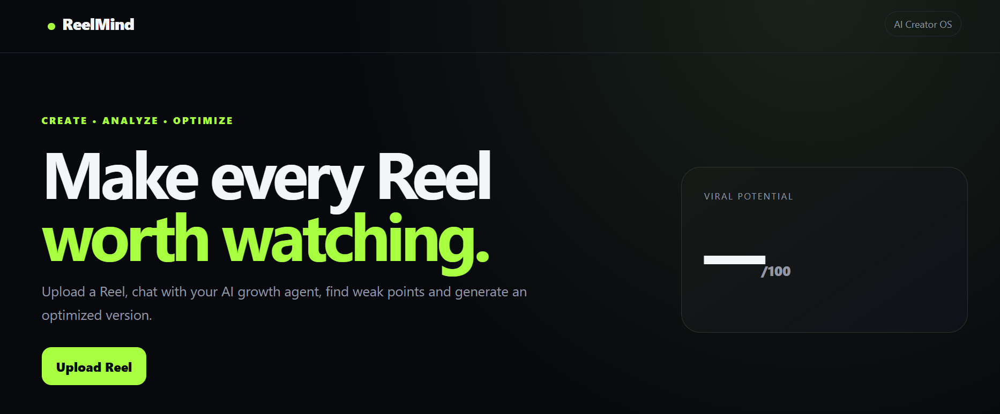
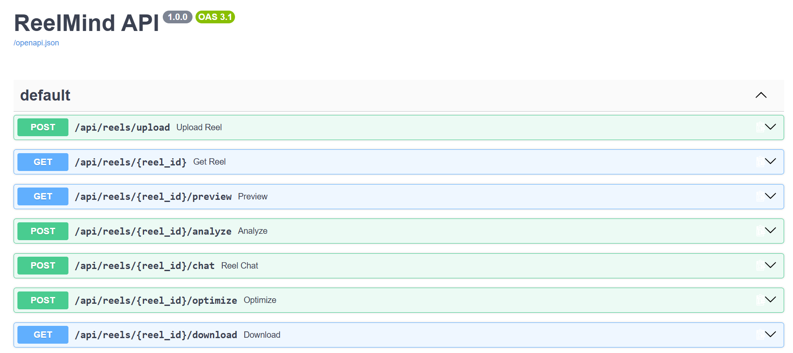

# ReelMind — AI Reel Growth & Editing Agent

Production-oriented starter for an AI creator platform:
- Next.js frontend
- FastAPI backend
- Chatbot + agent orchestration
- Reel upload
- FFmpeg video analysis/editing
- Whisper-compatible transcription
- AI analysis with OpenAI-compatible API
- SQLite for local development
- Background-ready architecture
- Safe "preview then approve" editing flow

## 1. Requirements
- Python 3.11+
- Node.js 20+
- FFmpeg installed and available on PATH
- OpenAI API key (optional: app falls back to deterministic local analysis)

## 2. Backend
```bash
cd backend
python -m venv .venv
# Windows:
.venv\Scripts\activate
# macOS/Linux:
# source .venv/bin/activate
pip install -r requirements.txt
copy .env.example .env   # Windows
# cp .env.example .env   # macOS/Linux
uvicorn app.main:app --reload --port 8000
```

## 3. Frontend
```bash
cd frontend
npm install
copy .env.local.example .env.local
npm run dev
```

Open http://localhost:3000

## 4. API
- POST /api/reels/upload
- GET /api/reels/{id}
- POST /api/reels/{id}/analyze
- POST /api/reels/{id}/chat
- POST /api/reels/{id}/optimize
- GET /api/reels/{id}/download
- GET /api/health

## 5. Important
The "viral score" is an optimization heuristic, not a guarantee of virality. Real prediction should later be trained on creator-level historical data and platform analytics.


